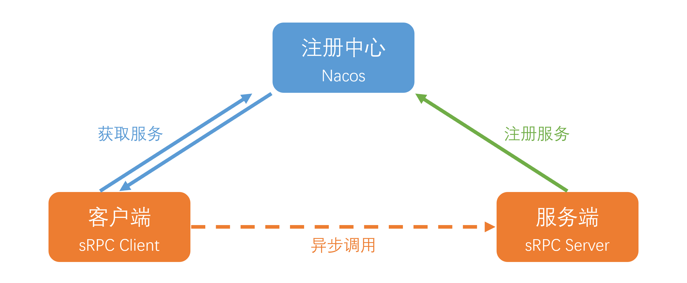

# sRPC

 [](https://app.travis-ci.com/histevehu/sRPC) [](https://makeapullrequest.com)

## 特性

- 支持基于 Java 原生 Socket 传输与 Netty 传输两种网络传输方式
- 支持四种序列化框架，Json、Kryo、Hessian 和 Google Protobuf
- 实现心跳机制和Channel复用，提供稳定和低开销的连接
- 实现随机算法、轮转和一致性哈希负载均衡算法：
- 实现自定义传输协议
- 使用 Nacos 作为注册中心，管理服务提供者信息
- 支持注解式声明服务及自动扫描注册
- 支持指定服务组和版本，实现接口和不同实现及版本的服务注册
- 支持集成 Spring 通过注解注册及注入服务
- 良好的接口抽象，模块耦合度低，支持SPI机制及通过配置文件进行配置，注册中心、网络传输、序列化器、负载均衡算法等均可自由配置

## 架构



## 模块概览

- **sRPC-api** ：服务接口
- **sRPC-common** ：实体对象、工具类等公用类
- **sRPC-core** ：sRPC框架的核心实现
- **testClient** ：测试用客户端
- **testServer** ：测试用服务端

## 传输协议（SRTP）

调用及其结果的传输采用了SRTP协议（sRPC Transport Protocol）

```
+---------------+---------------+-----------------+-------------+
|  Magic Number |  Package Type | Serializer Type | Data Length |
|    4 bytes    |    4 bytes    |     4 bytes     |   4 bytes   |
+---------------+---------------+-----------------+-------------+
|                          Data Bytes                           |
|                   Length: ${Data Length}                      |
+---------------------------------------------------------------+
```

| 字段              | 含义                                                                                             |
|:----------------|:-----------------------------------------------------------------------------------------------|
| Magic Number    | 魔数，标识这是一个 SRTP 协议包，默认为常量0x981017                                                               |
| Package Type    | 包类型，标识数据包是调用请求还是调用响应                                                                           |
| Serializer Type | 序列化器类型，标识这个包的数据部分的序列化方式                                                                        |
| Data Length     | 数据部分字节的长度                                                                                      |
| Data Bytes      | 数据部分。传输的对象，通常是一个`RpcRequest`或`RpcClient`对象，取决于`Package Type`字段，对象的序列化方式取决于`Serializer Type`字段。 |

## 使用

### 服务端

#### 下载运行 Nacos Server

以 Nacos 2.3.2 为例：

```shell
wget https://github.com/alibaba/nacos/releases/download/2.3.2/nacos-server-2.3.2.tar.gz
tar -xvf nacos-server-2.3.2.tar.gz
cd nacos/bin
sh startup.sh -m standalone
```

#### 定义并实现调用接口

```java
public interface HelloService {
    String hello(String name);
}
```

```java

@SrpcService
public class HelloServiceImpl implements HelloService {
    @Override
    public String hello(String name) {
        return "Hello, " + name;
    }
}
```

#### 编写启动类

sRPC支持手动注册和通过注解自动注册服务。以Netty方式为例：

##### 手动注册

```java
public class TestNettyServer {
    public static void main(String[] args) {
        NettyServer nettyServer = new NettyServer();
        HelloService helloService = new HelloServiceImpl();
        RpcServiceProperties rpcServiceProperties = new RpcServiceProperties();
        nettyServer.regService(helloService, rpcServiceProperties);
        nettyServer.start();
    }
}
```

##### 注解注册

```java

@SrpcServiceScan
public class TestNettyServer {
    public static void main(String[] args) {
        NettyServer server = new NettyServer();
        server.start();
    }
}
```

此外，sRPC支持集成Spring，因此还可通过以下方式启用服务的扫描注册：

```java

@SrpcServiceScanSpring
public class TestNettySpringServer {
    public static void main(String[] args) {
        new AnnotationConfigApplicationContext(TestNettySpringServer.class);
        NettyServer server = new NettyServer();
        server.start();
    }
}
```

### 客户端

客户端同样支持手动创建代理和注解注入两种方式获取服务：

#### 手动创建代理

```java
public class TestNettyClient {
    public static void main(String[] args) {
        RpcClient client = new NettyClient();
        RpcClientProxy rpcClientProxy = new RpcClientProxy(client);
        HelloService helloService = rpcClientProxy.getProxy(HelloService.class);
        String res = helloService.hello();
        System.out.println(res);
    }
}
```

#### 注解注入

这种方式需要使用Spring Framework：

```java

@SrpcServiceScanSpring
public class TestReferenceClient {
    public static void main(String[] args) {
        AnnotationConfigApplicationContext applicationContext = new AnnotationConfigApplicationContext(TestReferenceClient.class);
        ServiceAController serviceAController = (ServiceAController) applicationContext.getBean("serviceAController");
        System.out.println(serviceAController.hello());
    }
}
```

然后在需要自动注入的服务上加上 `@SrpcReference` 注解即可：

```java

@Component
public class ServiceAController {
    @SrpcReference
    private ServiceA serviceA;

    public String hello() {
        return serviceA.hello();
    }
}
```

## LICENSE

sRPC is under the MIT license. See the [LICENSE](https://github.com/histevehu/sRPC/blob/main/LICENSE)) file for details.
