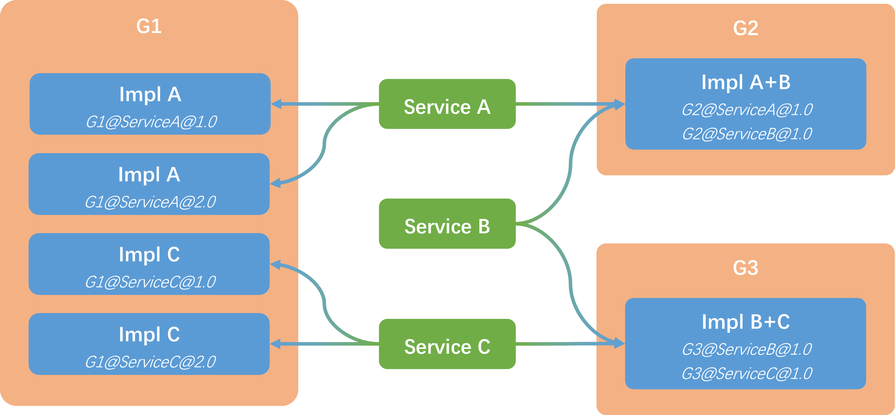

# sRPC中服务接口和服务实现的关系

sRPC支持通过指定服务接口对应的实现所在的服务组和版本实现服务接口和服务实现一对一、一对多、多对一、多对多的关系。

对于同一个服务接口的同一个实现的不同版本，需要通过设置版本号区分

对于同一个服务接口的不同实现，需要通过设置服务组区分

相关测试实现位于top.histevehu.srpc.testServer.serviceImpl.manyServices.impl下